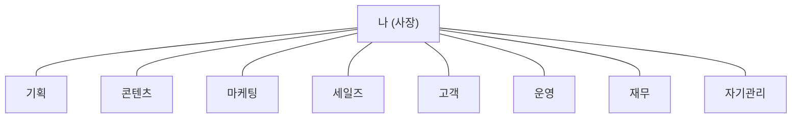

# /cab-interview — 인터뷰로 내 사업 파일 만들기

CAB 1기 W1 의 핵심 커맨드. 내 노트북의 Claude Code 가 짧은 인터뷰로 내 사업을 읽어 **① 8부서 지도 · ② 자동화 후보 우선순위 표 · ③ 꿈의 고객·사명·도구 파일**을 만들고 **`business/` 안에 실제 파일로 저장**한다.

> **이 커맨드는 "사업 사실"을 `business/*.md` 에 적는 데까지만 한다. CLAUDE.md(내 사업 매뉴얼)는 다음 단계에서 `/init` 이 이 파일들을 읽어 만든다.** (그래서 여기선 CLAUDE.md 를 건드리지 않는다.)
> 이건 강의가 아니라 내 사업을 같이 만드는 자리예요. 막히면 그 자리에서 태오한테 물어보세요.
> **한국어로, 컴퓨터 용어 최소로** 응답한다. (용어가 낯선 분이 있다 — 어려운 말은 한 줄 풀이를 붙인다.)

---

## STEP 0 — 재료 모으기 (입력)

재료는 **마인드맵에서 펼친 6가지**다. 아래 순서로 찾고, 빈 곳만 물어본다.

1. **마인드맵 텍스트가 있으면 그것부터** — XMind 등에서 펼친 마인드맵을 텍스트(또는 OPML)로 붙여넣었으면, 그걸 먼저 읽어 아래 6가지로 분류한다.
2. **현재 폴더 자동 탐색** — 폴더와 하위에서 사업·사명·반복업무·도구가 적힌 파일을 읽어 빈 곳을 채운다.
3. **그래도 빈 항목만 묻는다** — 다 채워졌으면 묻지 않는다. 7가지:
   - ① **내 사업 한 줄 + 사명** — "나는 [누구] 의 [어떤 문제] 를 [어떤 방법] 으로 푼다" + 왜 이 일을 하나(한 줄)
   - ② **꿈의 고객 한 명** — 나이·상황 + 밤에 잠 못 드는 통증 한 줄
   - ③ **시간을 가장 많이 먹는 반복업무 5~8개** (빈도 + 1회 소요) + **가장 벗어나고 싶은 통증 1개**
   - ④ **평소 쓰는 도구 전부** (10~25개, 떠오르는 대로)
   - ⑤ **§0 원칙 — 모든 결정 위에 두는 기준 하나** — "매출·숫자보다 뭘 먼저 보나" (예: 결과보다 내가 즐기는가 · 한 명이 진짜 변하는가). 막연하면 "어떤 일은 돈이 돼도 안 한다, 왜?" 로 되묻는다
   - ⑥ **내 톤 · 절대 금지어** — 말투(예: 따뜻·간결), AI 가 절대 쓰면 안 되는 표현
   - ⑦ **우선순위 3개 · 이번 분기 목표 · 안 하는 것**

> ③④ 는 8부서·자동화 재료, ①②⑤⑥⑦ 은 다음 단계(/init)가 CLAUDE.md 를 만들 재료다. 둘 다 한 번에 모아 `business/` 파일로 적어둔다.
> ⑤ §0 원칙은 이 사업의 영혼이다 — 막연해도 한 번 더 되물어 꼭 한 줄을 건진다. 이게 학생 CLAUDE.md 를 "내 기준대로 판단하는" 매뉴얼로 만든다.
> ⚠️ 입력이 빈약해도 멈추지 않는다. "아직 사업을 찾는 중"이면 그 관심·하려는 일을 **가설 사업**으로 두고 매핑한다. 말하지 않은 사실(가격·일정 등)은 **지어내지 않고** `<!-- 미정: 항목 -->` 으로 남긴다.

---

## STEP 1 — 8부서 골격에 매핑

내 사업이 어떤 형태든(영리·비영리·1인·매장·온라인·서비스), 1인 사업은 아래 8개 기능으로 나뉜다. 8개를 **고정 골격**으로 쓰되, 이름과 내용은 내 사업 언어로 바꾼다.

| # | 부서 | 하는 일 | 비영리·예외 환산 |
|---|---|---|---|
| 1 | **기획** | 사업 방향·상품·우선순위 설계 | 미션·프로그램 설계 |
| 2 | **콘텐츠** | 창작·메시지·채널 발행 | 그대로 |
| 3 | **마케팅** | 도달·유입·인지 (SNS·광고·SEO) | 인지·모집·홍보 |
| 4 | **세일즈** | 전환·결제·세일즈 시퀀스 | 후원 전환·신청 |
| 5 | **고객** | 응대·온보딩·후기·이탈 관리 | 수혜자·회원 관리 |
| 6 | **운영** | 일정·도구·자동화·기록 인프라 | 그대로 |
| 7 | **재무** | 매출·비용·세금·수익 구조 | 후원·지속가능성·예산 |
| 8 | **자기관리** | 번아웃·동기·페이스·시간 관리 | 그대로 |

각 부서마다 채운다: **역할 · 지금 누가(거의 "나 혼자") · 핵심 산출물 · 지금 쓰는 도구 · 자동화 후보**.

> STEP 0 의 반복업무·도구가 **어느 부서에도 안 들어가면**, 9번째 부서 신호일 수 있다 → "골격 밖 항목"으로 따로 모아 태오 검증 때 올린다.

### 예외 처리 규칙

- **사업이 2개 이상** → 부서를 2배로 늘리지 않는다. 8부서는 그대로 두고 각 칸 안에 두 사업을 나란히. 예: `콘텐츠 = [쇼핑몰 / 매장]`.
- **"모든 걸 자동화하고 싶다"** → 그대로 받지 않는다. STEP 0 ③ 통증 1개로 강제로 좁혀, 자동화 후보 표 맨 위 1줄만 W2 대상으로. ("자동화의 90%는 안 만들 것 정하기")
- **비영리·앱 운영** → 앱 자체 개발은 4주 범위 밖. 운영 자동화(콘텐츠·응대·트래킹)만 8부서에. 재무는 후원·지속가능성·임팩트로 환산.
- **용어가 낯선 분** → 부서명·후보를 더 쉬운 말로 풀고, 첫 자동화는 가장 단순한 것 1개로.

---

## STEP 2 — 출력물 2개

### (A) 내 사업 8부서 지도

한눈에 보이는 다이어그램(mermaid). 가운데 **나(사장)** 가 있고 7부서가 붙는 허브-스포크.

그 아래에 STEP 1 의 8부서 표(역할·지금누가·산출물·도구·자동화후보)를 붙인다.

### (B) 자동화 후보 우선순위 표

STEP 0 의 반복업무·통증을 모아 **영향 × 난이도** 로 줄 세운다. 통증 1순위는 맨 위 고정.

| 순위 | 자동화 후보 | 속한 부서 | 영향 (회수 시간) | 난이도 | W2 대상? |
|---|---|---|---|---|---|
| ⭐ 1 | (통증 1순위) | | 높음 | | ✅ 다음 주 1순위 |
| 2 | | | | | |

- **영향** = 자동화하면 매주 몇 시간 돌아오나
- **난이도** = 도구 연결·검수가 얼마나 복잡한가
- **W2 대상** = 다음 주에 실제로 만들 후보 1개 (영향 높고 난이도 낮은 것 우선)

---

## STEP 3 — 파일로 저장 (다음 단계 /init 이 읽을 수 있게)

채팅에만 띄우고 끝내지 않는다. **반드시 아래 파일에 실제로 Write** 한다. (`/init` 과 W2~W4 가 이 파일들을 "이전 산출물" 로 읽으므로, 저장이 안 되면 다음 흐름이 끊긴다.)

| 산출물 | 저장 위치 |
|---|---|
| 사업 한 줄 + 사명 (①) | `business/00-사명.md` 상단 |
| 꿈의 고객 (②) | `business/01-꿈의고객.md` |
| 8부서 지도 + 표 (STEP 2-A) | `business/02-8부서.md` |
| 자동화 후보 우선순위 표 (STEP 2-B) | `business/02-8부서.md` 하단 "자동화 후보 우선순위" |
| 도구 목록 (④) | `business/03-도구.md` |
| **§0 원칙 (⑤)** · 톤·금지어 (⑥) · 우선순위·목표·안 하는 것 (⑦) | `business/00-사명.md` 하단 "톤·원칙" (= /init 이 CLAUDE.md 로 옮길 재료) |

> **CLAUDE.md 는 만들지 않는다.** ①⑤⑥⑦ 같은 매뉴얼 재료도 일단 `business/` 안에 적어둔다. 다음 단계에서 `/init` 이 `business/` 전체를 읽고 CLAUDE.md 로 합친다. (§0 원칙은 `00-사명.md`에 또렷한 한 줄로 — /init 이 CLAUDE.md 의 "의사결정 원칙" 섹션 핵심으로 쓴다.)
> 저장 후 **"무엇을 어디에 저장했는지"** 한 줄로 보고한다. 발송·외부 전송은 하지 않는다(폴더 안 파일 저장만).

---

## STEP 4 — 검증 + 다음 단계 안내

저장 끝나면 점검하고, 다음에 할 일을 한 줄로 안내한다.

- [ ] **8부서가 다 찼나** — 빈 부서엔 "왜 비었나 / 어떻게 채우나" 한 줄
- [ ] **골격 밖 항목** — 8부서 어디에도 안 들어간 반복업무·도구
- [ ] **통증 1순위가 자동화 후보 1위와 맞나** (= 다음 주 W2 대상)
- [ ] **지어낸 사실 없나** — 모르는 건 `<!-- 미정 -->` 로 남았나
- [ ] **다음 단계 안내** — "이제 `/init` 을 실행하세요. Claude 가 `business/` 를 읽어 CLAUDE.md(내 사업 매뉴얼)를 만듭니다." 라고 마지막에 한 줄.

---

## 산출물 (이 커맨드가 끝나면 손에 남는 것 · 전부 `business/` 에 저장됨)

1. **8부서 지도** (`business/02-8부서.md`) — 다이어그램 + 표
2. **자동화 후보 우선순위 표** (`business/02-8부서.md` 하단) — 다음 주(W2) 만들 1개가 정해짐
3. **사명·꿈의고객·도구·톤 재료** (`business/00·01·03`) — 다음 단계 `/init` 이 CLAUDE.md 로 합칠 재료

> 결과를 빨리 내려고 조급해하지 마세요. 오늘은 내가 누군지를 파일로 적어두는 날이에요. 그거면 1주차는 충분해요.
