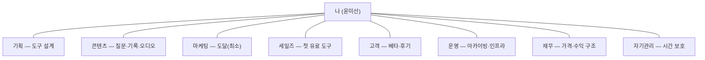

# 내 사업 8부서 (W1 산출물)

> `/cab-interview` 실행 결과. 가운데 **나(사장)** 가 있고 8개 기능이 붙는다.

| 부서 | 역할 | 지금 누가 | 핵심 산출물 | 쓰는 도구 | 자동화 후보 |
|---|---|---|---|---|---|
| 기획 | 도구 방향·우선순위 설계, 워크북/질문지/오디오 구조 설계, 분기 핵심질문 | 나 | 도구 설계안, 출시 로드맵 | ChatGPT, Claude, Claude Projects, Notion | ⭐ AI 대화·자료 → 질문·과제 자동 정리 (W2) |
| 콘텐츠 | 질문 설계, 기록지·오디오·PDF 제작, 브랜드 문장 다듬기 | 나 | 질문지, 기록지, 오디오, PDF | Canva, Word, Google Docs, 음성녹음 | 브랜드 문장·콘텐츠 초안 자동화 (금지어 필터 내장) |
| 마케팅 | 도달·인지 (필요 최소한) | 나 | 채널 글 (절제) | Threads, Instagram, YouTube | 보류 — §0상 SNS 운영 자체는 목적 아님 |
| 세일즈 | 첫 유료 도구 판매·결제 흐름 | 나 (아직 없음) | 판매 페이지, 결제 구조 | <!-- 미정: 결제·판매 채널 --> | 판매 페이지 초안 자동화 |
| 고객 | 베타 사용자 응대, 후기 수집, 개선 포인트 정리 | 나 (아직 없음) | 후기, 개선 리스트 | Gmail, 카카오톡 | 후기 수집·정리 자동화 |
| 운영 | 자료 읽고 정리, 아카이빙, 일정·도구 인프라 | 나 | 정돈된 아카이브 | Notion, Google Drive, Apple Notes, Calendar | 자료 아카이빙 자동 정리 |
| 재무 | 매출·비용·도구 가격 구조 | 나 | 가격·수익 구조 | Excel | <!-- 미정: 가격 정책 --> |
| 자기관리 | 페이스·번아웃 관리, **본업(대학 행정)과 사업 시간 분리** | 나 | 지속 가능한 리듬 | Apple Watch, Calendar | 사업 시간 확보 (블록 보호) |

### 골격 밖 항목 (태오 검증 때 올릴 것)

- **대학 행정업무 — 평일 매일 8~10시간.** 본업이라 4주 사업 범위 밖이지만, **하루 시간의 대부분을 차지**한다. → 8부서엔 안 넣고, *자기관리*에서 "사업에 쓸 시간을 어떻게 확보·보호하나" 관점으로만 다룬다. §0("내 몸이 갈리지 않는 구조")와 직결.

---

## 실제 반복업무 (지난 2주 · W1 마인드맵)

> 출시 전 단계라 고객관리·결제·마케팅보다, **실제 반복 중인 지식노동**(AI 대화 정리·자료 요약·질문 후보 생성)을 먼저 자동화한다.

| 영역 | 주요 작업 | 빈도 | 1회 소요 |
|---|---|---|---|
| 1. 사업 탐색 | 브랜드 방향·아이디어 비교·포지셔닝·문장 수정 | 주 5~7회 | 30~120분 |
| 2. AI 활용 | ChatGPT·Claude 아이디어 탐색·요약·검토·질문 생성 | 매일 | 1~3시간 |
| 3. 자료 연구 | 독서·영상·인터뷰·벤치마킹·참고자료 저장 | 주 5회+ | 30~120분 |
| 4. 첫 도구 설계 | 질문 작성·수정, 오디오·PDF 구조, 버전 업데이트 | 주 2~4회 | 30~90분 |
| 5. 글쓰기·기록 | 메모·편지 초안·문장 수집·회고 | 주 3~5회 | 20~60분 |
| 6. 자료 정리 | AI 대화 저장·폴더 정리·문서 분류·노션 정리 | 수시 | — |

---

## 자동화 후보 우선순위 (영향 × 난이도 매트릭스)

> 통증 1순위 = **"고민·탐색에 시간이 쏠려 출시가 늦는 구조"** → ②AI 활용(매일 1~3h)을 산출물로 바꾸는 것이 맨 위.

| 순위 | 자동화 후보 | 분류 | 속한 부서 | 영향 | 난이도 | W2 대상? |
|---|---|---|---|---|---|---|
| ⭐ 1 | **AI 대화·자료 → 질문·과제 자동 정리** (ChatGPT·Claude 대화·읽은 자료를 붙여넣으면 → 요약 + 핵심 아이디어 + 질문 후보 + 실행과제를 한 번에 뽑아냄) | Quick Win | 기획·콘텐츠 | 높음 (매일 1~3h를 출시 재료로) | 낮음 | ✅ **4주간 1순위** |
| 2 | 자료 자동 요약 (독서·영상·인터뷰 → 요약 + 적용점) | Quick Win | 기획·운영 | 중간 | 낮음 | |
| 3 | 질문 후보 자동 생성 (자료 → 주제 추출 → 질문 10개 → 도구별 분류) | Quick Win | 콘텐츠 | 중간 | 낮음 | |
| 4 | 질문/문장 라이브러리 + 지식베이스 구축 (금지어 필터 내장) | Major | 콘텐츠·기획 | 높음 | 중간 | (1순위 안정 후) |
| 5 | 첫 도구 제작 관리 시스템 (질문지·오디오·PDF 진행률·버전) | Major | 기획 | 중간 | 중간 | |
| 6 | 파일명·폴더·노션 템플릿 정리 | Fill In | 운영 | 낮음 | 낮음 | |

**제외(Not Worth It):** CRM·결제 자동화·마케팅 자동화·복잡한 멀티 에이전트 — *출시 후* 재검토. 지금 만들면 §0("내 몸이 갈리지 않는 구조") 위반(없는 고객을 위한 인프라).

- **영향** = 자동화하면 매주 몇 시간이 돌아오나 · **난이도** = 도구 연결·검수 복잡도
- **W2 대상** = ⭐1 하나만. "자동화의 90%는 안 만들 것 정하기."
